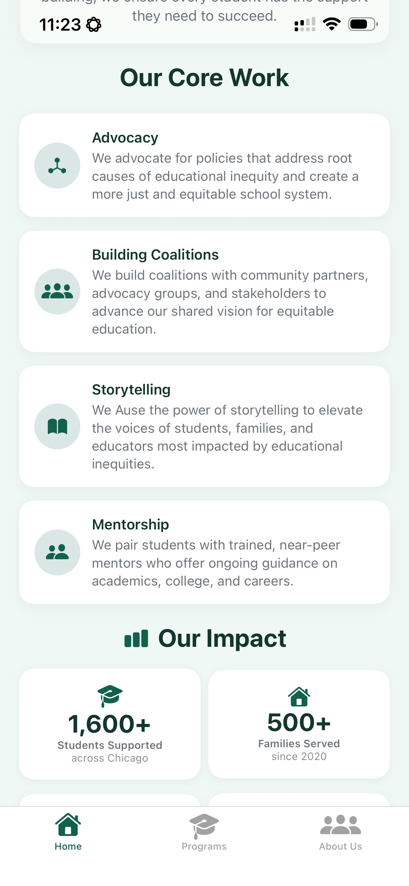
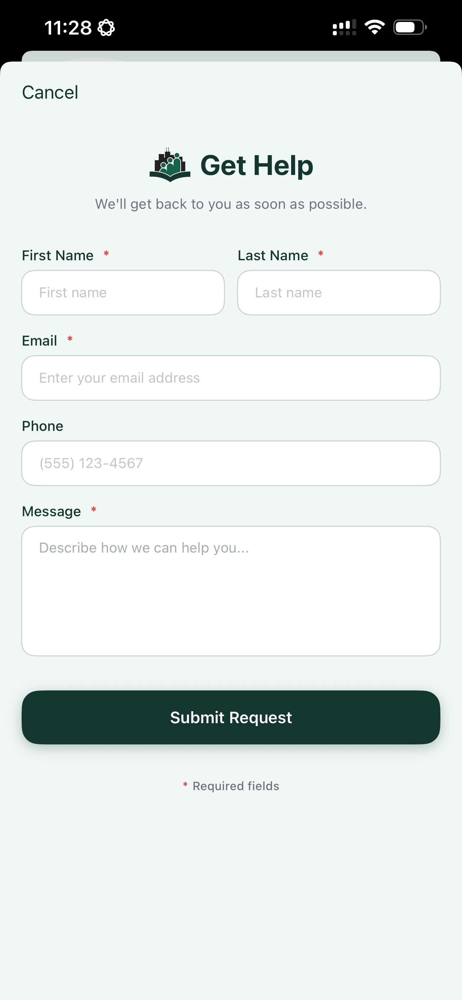

#  ChiEAC iOS App

A native iOS application for the Chicago Education Advocacy Cooperative (ChiEAC), empowering students and families across Chicago through education advocacy, resources, and community support.

## Overview

The ChiEAC iOS app serves as a comprehensive platform connecting Chicago students and families to educational resources, advocacy programs, and community support services. Built with SwiftUI and Firebase, the app provides real-time access to organizational content, program information, team details, and educational articles.

## Screenshots

<p align="center">
  
  
  
</p>

<p align="center">
  
  
  
</p>

<p align="center">
  
  
  
</p>

<p align="center">
  
  
</p>

## Features

### Core Functionality
- **Home Dashboard**: Mission overview, core work highlights, and impact statistics with loading states
- **Programs**: Educational program listings with detailed descriptions and contact options
- **About Us**: Team profiles organized by groups with expandable member details
- **Article Library**: Collection of educational articles with search functionality and tag-based filtering
- **Contact Forms**: Specialized contact forms for getting help, program enquiry, etc.
- **Support Mission**: Donation information with impact metrics and floating call-to-action elements

### User Experience
- **Search & Filtering**: Real-time article search with multi-tag filtering and clear all options
- **Loading States**: Skeleton screens and progress indicators during content loading
- **Pull-to-Refresh**: Manual refresh capability across content sections
- **Form Navigation**: Keyboard toolbar with next/previous field navigation
- **Image Loading**: Optimized image loading with placeholder fallbacks

### Technical Features
- **Offline Support**: Firebase Firestore caching for offline content access
- **Network Monitoring**: Real-time connectivity status with retry mechanisms and user feedback banners
- **Image Caching**: Kingfisher integration for efficient image storage and retrieval
- **Error Handling**: Alert dialogs with retry options for failed operations
- **Form Validation**: Field validation with error messaging (validates on submission)
- **Light Mode**: App forces light mode appearance throughout

### Data Management
- **Real-time Sync**: Firebase Firestore integration for dynamic content updates
- **Background Refresh**: Content updates when app becomes active
- **Centralized State**: AppDataManager handles all app-wide data with Combine publishers

## Technical Architecture

### Technology Stack
- **Framework**: SwiftUI (iOS 18.5+)
- **Backend**: Firebase Firestore
- **Image Caching**: Kingfisher
- **Architecture**: MVVM with Combine framework
- **Language**: Swift 5.0

### Project Structure
```
ChiEAC/
├── Models/           # Data models and structures
├── Views/            # SwiftUI views organized by feature
│   ├── Home/         # Home screen and related views
│   ├── Programs/     # Program listings and details
│   ├── About/        # Team and organization information
│   └── Forms/        # Contact forms and user input
├── ViewModels/       # Business logic and state management
├── Services/         # Data repository and Firebase integration
├── Components/       # Reusable UI components
├── Utils/            # Utilities, colors, typography, and helpers
└── Assets.xcassets   # App icons, images, and visual assets
```

### Key Components
- **AppDataManager**: Centralized data management with offline-first approach
- **FirestoreRepository**: Firebase integration with caching strategies
- **Network Monitoring**: Real-time connectivity status and retry mechanisms
- **Custom Typography**: Brand-consistent text styling system
- **Color System**: Comprehensive brand color palette

## Requirements

- **iOS**: 18.5 or later
- **Device**: iPhone (portrait orientation)
- **Dependencies**:
  - Firebase SDK 12.1.0+
  - Kingfisher 8.5.0+

## Installation

### Prerequisites
1. Xcode 16.4 or later
2. iOS 18.5+ deployment target
3. Swift 5.0

### Setup
1. Clone the repository:
   ```bash
   git clone [repo link]
   cd ChiEAC-iOS-App
   ```

2. Open `ChiEAC.xcodeproj` in Xcode

3. Configure Firebase:
   - Add your `GoogleService-Info.plist` to the project
   - Ensure Firebase project is properly configured

4. Build and run the project on your target device or simulator

## Configuration

### Firebase Setup
The app requires a properly configured Firebase project with Firestore database. The following collections are expected:
- `organization` - Organization information and mission
- `core_work` - Core work items and descriptions  
- `impact_stats` - Impact numbers and statistics
- `programs` - Educational programs and details
- `teams` - Team information and member profiles
- `articles` - Educational articles and resources
- `external_links` - Social media and external resource links

### Bundle Configuration
The following settings are configured in the Xcode project. **You will need to change these if you want to run the app on your own devices or publish it:**

- **Bundle Identifier**: `org.chieac.app.ChiEAC` - Change this to your own unique identifier (e.g., `com.yourname.ChiEAC`)
- **Display Name**: ChiEAC - The app name shown on the home screen
- **Development Team**: 5CSUNRQ4X3 - **You must change this to your own Apple Developer Team ID** to sign the app

> **Note**: To run this project, you'll need to update the Bundle Identifier and Development Team in Xcode's project settings to match your Apple Developer account. The current settings are specific to the original developer's account.

## Features in Detail

### Data Management
- **Offline-First Architecture**: Content cached locally for offline access
- **Smart Connectivity**: Automatic retry mechanisms with user feedback
- **Background Refresh**: Content updates when app becomes active
- **Error Handling**: Comprehensive error states with retry options

### User Interface
- **Native iOS Design**: Platform-consistent UI following Apple's design guidelines
- **Dynamic Typography**: Support for iOS Dynamic Type and accessibility
- **Responsive Layout**: Optimized for various iPhone screen sizes
- **Loading States**: Skeleton screens and progress indicators

## Development

### Code Organization
The project follows MVVM architecture with clear separation of concerns:
- **Models**: Define data structures and Firebase document mapping
- **Views**: SwiftUI views with minimal business logic
- **ViewModels**: Handle business logic, API calls, and state management
- **Services**: Repository pattern for data access and Firebase integration

### Testing
- Unit tests for ViewModels and Services
- UI tests for critical user flows
- Firebase integration testing

## Contributing

1. Fork the repository
2. Create a feature branch (`git checkout -b feature/amazing-feature`)
3. Commit your changes (`git commit -m 'Add amazing feature'`)
4. Push to the branch (`git push origin feature/amazing-feature`)
5. Open a Pull Request

### Code Standards
- Follow Swift API Design Guidelines
- Use SwiftUI best practices
- Maintain MVVM architecture
- Include appropriate documentation
- Write unit tests for new functionality

##
This project is proprietary software owned by the Chicago Education Advocacy Cooperative (ChiEAC). All rights reserved.

Built with ❤️ for ChiEAC by [Shivaang Kumar](https://github.com/shivaaang)